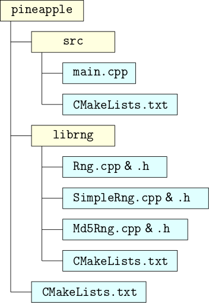

# CMake @HPCoffee

Author: Guus Bertens\
Date: 13 April 2022

In this section we discuss CMake, a build system generator.  First we'll give some motivation for its existence.  Then we'll discuss the user's side of CMake, followed by the developer's side.  A comparison of CMake with other build system is out-of-scope.

## Building software

Small codes can often easily be build as follows:

```bash
g++ -o pineapple main.cpp Rng.cpp SimpleRng.cpp Md5Rng.cpp -lcrypto
#       ^ output  ^-- source files --^------------^          ^ required library
```

At first glance this looks fine, but when you are developing a code, you often change a single file and then recompile the code.  The above command is oblivious to this, and will recompile all your source files, even if only one changed.  Some languages, like C++, are slow to compile, so for larger codes (25+ source files) this becomes cumbersome.  For very large codes (1000+ source files) it becomes impossibly slow, no matter what language they're in.

Enter *makefiles*.  Makefiles describe the dependencies between various header files, source files, object files (intermediate step), and the final executable as a directed graph.  For example:


When invoked, `make` traverses the graph, and compiles files only as needed. Here, if `main.cpp` is changed, then only `main.o` and `pineapple` are updated.

There is a problem with this: while the relationships between `.c` and `.o` files are 1-to-1, and are easy to manage in a Makefile, the relationships between `.h` and `.cpp` files are many-to-many and change often, and are therefore hard to manage.

Furthermore, as projects grow, they often start to rely on external libraries, for instance to support specific file formats (e.g. HDF5) or to support multi-node parallelisation (e.g. MPI).  Sometimes this added functionality isn't needed, or a specific library is not a available on a system.  In such cases, ideally one should be able to easily tell the compiler to omit these libraries.

CMake aims to solve these problems, and more.  It does this by reading instructions from `CMakeLists.txt` files, and uses those to generate a build system.  On Linux it will typically generate a set of makefiles, so ultimately `make` is still used to build the software.  CMake will also take care of dependencies on header files, and allows you to easily enable or disable specific parts of a code, for instance to account for the presence or absence of certain libraries.

In the following, we'll first look at how to use CMake if you encounter it in the wild.  Thereafter, we'll see what CMake can do for you as a software developer.

## CMake for users

You downloaded a piece of software that requires CMake to compile.  One such code is ecCodes, a library that is used in the earth systems science community to read and write certain file formats.  In this example we're using version 2.25.0.  

The first thing to know is that CMake likes *building out-of-tree*, which means that the build files will not mingle with the source files.  This means two things:

* You must create an extra directory, e.g. `build`, in which the compilation happens.
* If compilation goes wrong, you can just throw that directory away and start over.

To get started, we first go into ecCodes' source directory, create a build directory, go into it, and tell CMake where to find the root `CMakeLists.txt` file.  So:

```bash
cd eccodes-2.25.0  # Go into source directory
mkdir build        # Make an empty build directory
cd build           # We're now in eccodes-2.25.0/build
cmake ..           # Tell CMake to look in eccodes-2.25.0 for CMakeLists.txt
```

At this point, CMake will try to detect what compilers you have, what libraries are available, and, if all is well, generate a set of makefiles in the `build` directory, using ecCodes' default build settings.  This is typically followed by

```bash
make               # Compiles everything.
make install       # Installs the software (whereto?)
```

to build and then to install ecCodes.

But where does this install the software?  And what libraries and other settings did it really use?  CMake puts all of its settings in *variables* in the *CMake cache*.  CMake can show you the contents of its cache, including some descriptive text:

```bash
cmake .. -L        # List cached variables.
cmake .. -LH       # Include descriptions as well.
cmake .. -LAH      # Include advanced variables as well.
```

`cmake .. -LH` tells us about a number of variables, but for now we're interested in only this one:

```
// Install path prefix, prepended onto install directories.
CMAKE_INSTALL_PREFIX:PATH=/usr/local
```

So by default, ecCodes will be installed into `/usr/local`.  To change the location, we use CMake's `-D` argument to change (**D**efine) this variable's value:

```bash
cmake .. -D CMAKE_INSTALL_PREFIX=/home/jack/software/eccodes-2.25.0
make               # Compiles everything.
make install       # Installs the software
```

To set multiple options, you can use the `-D` argument multiple times in a single CMake invocation.  For convenience, CMake also comes with (quasi-)graphical utilities to make configuration easy: `ccmake` and `cmake-gui`.

If CMake gives an error, it will often also give some hints as to what went wrong.  Often a library is missing, which can be solved by doing an appropriate `module load` on many HPC systems, and rerunning CMake.  Sometimes, additional `-D` arguments must be given, e.g. to tell CMake to omit unavailable libraries, or to use a specific compiler.  Querying the cache (`cmake -LH`) gives further hints on what variables to use for this.

And if things really go badly, just remove the `build` directory, and try again.

## CMake for developers

To use CMake as a developer, we first need some example code.  Here we'll use a code called `pineapple`, which is a toy code that computes $\pi$ .  It does so by repeatedly drawing two random numbers $x$ and $y$ between 0 and 1, and requiring that $x^2+y^2<1$.  The ratio of hits to total attempts approaches $\pi/4$.

To get pseudorandom numbers, `pinapple` by default uses a built-in random number generator (RNG), but it can also use OpenSSL's secure hashing functions.  However, for this `pineapple` must be built with support for the libcrypto library.

The first version (v1) of the code is a single file.  It **requires** OpenSSL to be present when building.


The `CMakeLists.txt` file contains:

```cmake=
cmake_minimum_required(VERSION 3.16)
project(Pineapple VERSION 0.1 LANGUAGES CXX)

find_package(OpenSSL)

add_executable(pineapple main.cpp)
target_compile_features(pineapple PRIVATE cxx_std_17)
target_link_libraries(pineapple PRIVATE OpenSSL::Crypto)

install(TARGETS pineapple)
```

Let's dissect this:

* Line 1 tells CMake what version of CMake is minimally required to process this file.  Older versions of CMake will complain, and will also tell the user what version CMake is needed.
* Line 2 gives the project a name, and specifies what languages it uses.  This in turn directs CMake to look for certain compilers.
* Line 4 instructs CMake to find the OpenSSL libraries.
* Line 6 adds an executable target, called `pineapple`.
* Line 7 says that to compile the `pineapple` target, C++17 is needed.
* Line 8 says that to link the `pineapple` target, the OpenSSL::Crypto library is needed.  OpenSSL::Crypto is also a target, that was brought into existence by line 4.  To see what other targets line 4 brought into existence, please see https://cmake.org/cmake/help/latest/module/FindOpenSSL.html.  Many `find_package` commands will bring a number of new targets to life.
* Line 10 says that `make install` should install `pineapple` target.  CMake understands that this target is an executable called `pineapple` (cf. line 6), and hence will install it as `/bin/pineapple`.

From this it should be clear that CMake operates on *targets*.  Just like `make`, it builds a graph of targets, and based on that it decides what should get built, and how.  However, unlike `make`, CMake's targets are higher level and easier to maintain.  They contain much more information.  The OpenSSL::Crypto target, for instance, contains information on where the library can be found, where its header files can be found, and exactly how the compiler and linker must refer to it.

The next version (v2) refactors the code: the random number generators are put into individual files.  Such steps are often taken to keep the code clean: it is easier to reason about a many smaller chunk of single-purpose code, than it is to reason about interwoven bits of code in a single, large file.


The `CMakeLists.txt` file contains:

```cmake=
cmake_minimum_required(VERSION 3.16)
project(Pineapple VERSION 0.1 LANGUAGES CXX)

find_package(OpenSSL)

add_executable(pineapple main.cpp Rng.cpp SimpleRng.cpp Md5Rng.cpp)
target_compile_features(pineapple PRIVATE cxx_std_17)
target_link_libraries(pineapple PRIVATE OpenSSL::Crypto)

install(TARGETS pineapple)
```

Only line 6 changed: besides `main.cpp`, the various random generator source files are now also mentioned.

Version 3 makes linking with OpenSSL optional.  The corresponding `CMakeLists.txt` file contains:

```cmake=
cmake_minimum_required(VERSION 3.16)
project(Pineapple VERSION 0.1 LANGUAGES CXX)

add_executable(pineapple main.cpp Rng.cpp SimpleRng.cpp)
target_compile_features(pineapple PRIVATE cxx_std_17)

option(WITH_OPENSSL "Build with OpenSSL (enables MD5 RNG)" OFF)
if (WITH_OPENSSL)
	find_package(OpenSSL)
	target_link_libraries(pineapple PRIVATE OpenSSL::Crypto)
	target_sources(pineapple PRIVATE Md5Rng.cpp)
	target_compile_definitions(pineapple PRIVATE ENABLE_MD5RNG)
endif()

install(TARGETS pineapple)
```

Let's dissect this again:

* Everything related to OpenSSL is moved to lines 9--12.
* Lines 9--12 are wrapped in an if-block.  This if-block is only executed if the variable `WITH_OPENSSL` is true.
* Line 8 declares `WITH_OPENSSL` the be a boolean, and to be an *option* variable, meaning that the user can set it from the command line or from `ccmake` or so.  It also provides a default value and an explanation for this option.
* Line 4 no longer includes `Md5Rng.cpp`; this file relies on OpenSSL, and should only be compiled if OpenSSL is available.
* Line 11 includes `Md5Rng.cpp`.
* Line 12 tells the compiler to `#define ENABLE_MD5RNG`, which is used in some of the other source files to include code, but only if OpenSSL is present.
* Line 10 tells the linker to link with OpenSSL's libcrypto.

Version 4 puts the random number generators into their own library.  This allows other codes to use our random number generators as well.  The corresponding `CMakeLists.txt` file contains:

```cmake=
cmake_minimum_required(VERSION 3.16)
project(Pineapple VERSION 0.1 LANGUAGES CXX)

add_executable(pineapple main.cpp)
target_compile_features(pineapple PRIVATE cxx_std_17)

### RNG stuff

add_library(rng SHARED Rng.cpp SimpleRng.cpp)
target_compile_features(rng PRIVATE cxx_std_17)

option(WITH_OPENSSL "Build with OpenSSL (enables MD5 RNG)" OFF)
if (WITH_OPENSSL)
	find_package(OpenSSL)
	target_link_libraries(rng PRIVATE OpenSSL::Crypto)
	target_sources(rng PRIVATE Md5Rng.cpp)
	target_compile_definitions(rng PRIVATE ENABLE_MD5RNG)
endif()

install(TARGETS rng)

### RNG stuff done

target_link_libraries(pineapple PRIVATE rng)

install(TARGETS pineapple)
```

Let's take this apart:

* Line 9 defines the CMake target `rng` to be a shared library, that is built from `Rng.cpp` and `SimpleRng.cpp`.
* Line 10 states that `rng` must be compiled using C++17.
* Lines 12--18 still relate to OpenSSL, but they now apply to the `rng` target instead of the `pineapple` target.
* Line 20 indicates that the `rng` target should be installed by `make install`.  CMake understands that this is a library, and that it is called `rng`, so it will install it to `/lib/librng.so`.
* Line 24 says that `pineapple` should be linked with the `rng` library.

Version 5 moves the random number generators to their own dirctory.  The directory structure is now starting to look like that of a large project:


The top-level `CMakeLists.txt` contains:

```cmake=
cmake_minimum_required(VERSION 3.16)
project(Pineapple VERSION 0.1 LANGUAGES CXX)

add_subdirectory(librng)

add_executable(pineapple main.cpp)
target_compile_features(pineapple PRIVATE cxx_std_17)
target_link_libraries(pineapple PRIVATE rng)
install(TARGETS pineapple)
```

Everything corresponding to the `rng` target is moved to `librng/CMakeLists.txt`.  In the top-level `CMakeLists.txt` file, these lines are replaced with a single line, line 4 above, that tells CMake to look in the `librng` directory for another `CMakeLists.txt` file.

Version 6 moves the main code to its own directory:



The top-level `CMakeLists.txt` is now dead simple:

```cmake=
cmake_minimum_required(VERSION 3.16)
project(Pineapple VERSION 0.1 LANGUAGES CXX)

add_subdirectory(librng)
add_subdirectory(src)
```

Everything that corresponds to the `pineapple` target is moved to `src/CMakeLists.txt`.

## Links

* CMake documentation: https://cmake.org/documentation/
* ecCodes: https://confluence.ecmwf.int/display/ECC
* `pineapple` example code: https://github.com/guusbertens/pineapple-cmake-example - code versions are tagged, and can be checked out with for example `git checkout v1`.
